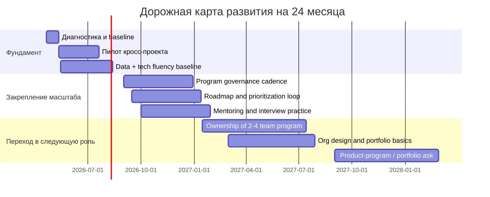

# ЛПР для middle+/senior Project Manager в бигтехе с фокусом на кросс‑проекты

## Резюме для руководителя

Для middle+/senior Project Manager в бигтехе самый сильный вектор роста в кросс‑проектную роль — это переход от модели **«владелец сроков и delivery внутри одного потока»** к модели **«владелец межкомандного результата, зависимостей, управленческих решений и прозрачности для руководства»**. Это хорошо согласуется и с программным управлением по стандарту **entity["organization","Project Management Institute","newtown square, pa, us"]**, где программа — это координация связанных проектов ради стратегических целей и benefits realization, и с актуальными требованиями в бигтехе: в **entity["company","Google","mountain view, ca, us"]**, **entity["company","Amazon","seattle, wa, us"]** и **entity["company","Meta","menlo park, ca, us"]** cross‑functional/program‑роли завязаны на управление рисками, зависимостями, техническими компромиссами, коммуникацией с руководством и выравниванием нескольких функций вокруг общего результата. citeturn34view0turn34view1turn31view0turn31view1turn29view0turn29view1turn17search2

Практически это означает, что ЛПР должен быть **T‑shape**. Вертикаль — сильная экспертиза в program/cross‑project execution: charter, governance, dependency management, RAID, decision log, status architecture, roadmap, quarterly planning, escalation. Горизонталь — базовая уверенная ширина в продукте, данных, технической архитектуре, надежности систем, орг‑дизайне и развитии людей. Такой профиль хорошо ложится на логику PMI Talent Triangle — Ways of Working, Power Skills и Business Acumen — и на современную product operating model‑логику, где команды отвечают не только за output, но и за outcome. citeturn34view2turn33view0

Если цель — вырасти в Program Manager, Senior/Lead PM или Product Program Manager, то в приоритете должны стоять не «ещё больше контроля сроков», а пять более дорогих для рынка навыков: **межкомандное выравнивание**, **управление решениями**, **данные для управленческих выборов**, **техническая внятность без ухода в инженерную роль** и **продуктовое мышление с акцентом на outcome**. Именно они отделяют сильного senior PM от человека, который хорошо ведёт несколько проектов, но пока не управляет системой взаимодействий между ними. citeturn31view0turn31view1turn29view0turn29view1turn33view0

Оптимальный горизонт развития в вашем случае выглядит так: **6 месяцев** — собрать фундамент и провести один качественный кросс‑проектный пилот; **12 месяцев** — закрепиться как владелец программы или крупного межфункционального потока на 2–4 команды; **24 месяца** — перейти к управлению портфелем инициатив, организационным интерфейсом между продуктом и engineering, либо к Product Program Manager / TPM‑adjacent роли. citeturn35view0turn34view0turn31view0turn31view1

## Допущения и профиль исходной роли

Ниже — допущения, на которых построен этот ЛПР. Это не факты о вашей текущей позиции, а рабочая модель, чтобы план был применим без деталей о компании, домене и составе команды.

| Область | Рабочее допущение |
|---|---|
| Уровень | Вы уже уверенно ведёте delivery, умеете работать со сроками, рисками, бэклогом, коммуникацией и несколькими стейкхолдерами |
| Текущий масштаб | У вас есть 1 основной поток/продукт/проект и влияние на соседние команды, но ещё не закреплена формальная роль program owner |
| Контекст бигтеха | Среда с высокой межфункциональностью: product, engineering, analytics/data, design, ops, legal/compliance, leadership |
| Основной разрыв | Недостаточно системного владения межкомандными зависимостями, управленческими ритуалами, продуктовым контекстом и техническим языком |
| Цель | Стать человеком, которому можно доверить программу изменений, запуск платформенной инициативы, крупный кросс‑проект или product program stream |

В этом отчёте я исхожу из того, что **T‑shape для PM** в бигтехе — это не «немного знать всё подряд», а иметь одну глубокую опору и несколько управленчески полезных соседних компетенций. Глубина — program execution и cross‑project orchestration. Ширина — product, data, technical fluency, org design, people leadership. Именно такая комбинация лучше всего отражает требования PMI к успеху program manager и то, как бигтех‑роли сочетают business acumen, power skills и operational rigor. citeturn34view1turn34view2turn31view0turn31view1

## Целевые роли и карьерные маршруты

Актуальные описания ролей в бигтехе показывают, что границы между Program Manager, Technical Program Manager, Product Program Manager и senior delivery‑ролями размыты, но центр тяжести у них разный. Везде нужна кросс‑функциональная координация, однако различается доля product, technical и org‑level ответственности. citeturn31view0turn31view1turn29view0turn29view1turn17search2

| Целевая роль | Что меняется относительно senior PM | Какие артефакты и доказательства нужны для перехода | Почему это логичный следующий шаг |
|---|---|---|---|
| **Program Manager** | Фокус смещается с одного проекта на набор связанных инициатив, их стратегическое выравнивание, governance, benefits realization | Program charter, dependency map, monthly/quarterly review, benefits dashboard, executive memo, RAID/decision log | PMI описывает program management как координацию связанных проектов ради стратегических целей и выгод, а Amazon PM‑роль прямо акцентирует data‑driven, risk‑focused, alignment‑ориентированное управление. citeturn34view0turn35view0turn29view0 |
| **Senior/Lead PM** | Больше масштаба, больше орг‑влияния, выше требования к приоритизации, управлению изменениями, наставничеству и статусным коммуникациям | Evidence of leading 2–4 streams, escalation patterns, leadership feedback, mentoring juniors, reusable playbooks | Это путь для тех, кто хочет оставаться в PM/delivery‑трека, но вести более сложную систему исполнения. Google Mid/Senior TPM‑объявления и Amazon PM interview framework показывают сдвиг к аналитике, executive communication и cross‑team coordination. citeturn31view0turn31view1turn29view0turn29view2 |
| **Product Program Manager** | Нужно уметь связывать roadmap, launch, risks, go‑to‑market, functional partners и product outcomes, а не только delivery mechanics | Launch readiness pack, roadmap linked to goals, risk review across functions, dependency ownership across product + eng + ops | Meta описывает product & program management как управление инициативами от conception до launch, а продуктовые практики modern product model требуют привязки работы к outcome, а не к списку фич. citeturn17search2turn33view0 |
| **Adjacent path: Technical Program Manager** | Добавляется уверенная работа с technical trade‑offs, system boundaries, architecture reviews, reliability and release risk | Architecture one‑pagers, release readiness checklist, postmortem facilitation, SLO/error budget understanding | В Google и Amazon TPM‑роли упор сделан на технические компромиссы, зависимости, риски, систему в целом и коммуникацию между engineers и leadership. citeturn31view0turn31view1turn29view1 |

**Рекомендуемый базовый маршрут** для вашей цели:  
**6 месяцев** — стать сильным senior PM с formalized cross‑project scope.  
**12 месяцев** — закрепиться как program owner одного кросс‑командного направления.  
**24 месяца** — выйти на роль Program Manager / Product Program Manager, а при более сильной техветке — на TPM‑adjacent позицию. citeturn35view0turn31view0turn31view1

## Компетентностная модель и приоритеты

С точки зрения рынка и внутренних карьерных переходов в бигтехе приоритеты лучше выставлять не по принципу «что интересно изучать», а по принципу **что быстрее увеличивает доверяемый масштаб ответственности**. Этим масштабом становятся межкомандные решения, прозрачность для leadership и способность удерживать outcome в системах с зависимостями. citeturn34view0turn31view0turn29view0

| Приоритет | Компетенции | Почему это вверху очереди |
|---|---|---|
| Очень высокий | Cross‑project/program management; roadmap & prioritization; risk & dependency management; stakeholder communication | Это ядро program‑роли: связанные проекты, стратегическое выравнивание, technical/non‑technical risks, executive visibility. citeturn34view0turn31view0turn29view0turn29view1 |
| Высокий | Leadership & influence; data literacy; product management skills | Без этого PM остаётся «координатором delivery», а не владельцем управленческих решений и product outcomes. citeturn34view2turn33view0turn31view1 |
| Средне‑высокий | Technical depth; org design & governance | Это даёт credibility у engineering и позволяет тянуть platform‑, infra‑ и org‑level инициативы без ухода в инженерную карьеру. citeturn31view0turn29view1turn15search4turn15search3 |
| Средний | Hiring / mentoring | Эти навыки становятся обязательными, когда от вас ожидают не только delivery, но и формирование стандарта работы команды/направления. citeturn24search10turn24search9turn26search2 |

## Матрица развития по компетенциям

### Program execution layer

| Компетенция | Learning objectives | Навыки в приоритете | Конкретные активности | Курсы / статьи / кейсы | Менторство / ротации | Метрики успеха |
|---|---|---|---|---|---|---|
| Cross‑project / program management | Перейти от управления проектом к управлению программой связанных инициатив | Program charter, benefits mapping, governance cadence, RAID, decision log, dependency board, exec reporting | Взять 1 программу на 2–4 команды; вести monthly review; собрать dependency owner map; внедрить единый status narrative | Стандарт entity["organization","Project Management Institute","newtown square, pa, us"] по program management; PgMP handbook/ECO; PMI Talent Triangle. citeturn34view0turn34view1turn34view2 | Shadow у сильного program/TPM lead на квартальном планировании; временно стать driver для одной многофункциональной инициативы | ≥80% ключевых межкомандных зависимостей имеют owner и дату; executive updates укладываются в 1 страницу; не более 10–15% «сюрпризов» на steerco |
| Roadmap & prioritization | Научиться связывать проекты с продуктовой/бизнес‑логикой, а не только со сроком | Outcome framing, now‑next‑later, cost of delay, WSJF, RICE, decision packages | Раз в квартал пересобирать roadmap через цели, а не через «список хотелок»; отделить product roadmap от delivery plan | Google OKRs; Atlassian roadmap guide; WSJF в SAFe; DACI. citeturn24search3turn41view3turn2search0turn41view2 | Попросить product lead ревьюить одну приоритизационную сессию; провести 1 workshop по trade‑offs | У каждой инициативы есть «почему сейчас» и measurable KR; доля задач без явной цели <10%; leadership принимает приоритезацию без повторного переписывания |
| Risk & dependency management | Перевести риски из формального реестра в рабочий управленческий инструмент | Dependency taxonomy, early warning signals, escalation thresholds, mitigation plans, postmortem follow‑through | Разделить risks на business / operational / technical / external; ввести weekly risk review; завести dependency SLA | Google SRE error budget / SLO docs; AWS Builders Library; RACI/DACI. citeturn12search0turn12search3turn12search9turn12search1turn12search4turn41view0turn41view2 | Участвовать в 2 postmortem и 1 launch readiness review; shadow у incident/program owner | 100% критических рисков имеют owner+mitigation; зависимость эскалируется до дедлайна, а не после; доля late surprises снижается квартал к кварталу |
| Stakeholder communication | Построить систему коммуникации, а не героические разовые синки | Stakeholder segmentation, narrative writing, comms cadence, executive memo, conflict de‑escalation | Построить stakeholder map и communication plan на один крупный поток; вести 1 письменный weekly update для leadership | entity["company","Atlassian","sydney, nsw, au"]: stakeholder mapping, stakeholder communication plan, RACI; Google re:Work про coaching in one‑on‑ones. citeturn41view1turn41view4turn41view0turn26search1 | Попросить руководителя давать red‑pen feedback на 6–8 executive memos подряд | Снижение числа ad‑hoc эскалаций; рост доли решений, принимаемых без дополнительного разъяснения; feedback от 3–5 ключевых stakeholders ≥4/5 |
| Data literacy | Научиться не «просить графики», а принимать и оспаривать решения на основании данных | Metrics tree, SQL/BI fluency, visualization critique, what‑if modeling, data storytelling | Составить metrics tree направления; построить 1 dashboard; ежемесячно делать decision memo на цифрах | Google Data Analytics Certificate; Azure Data Fundamentals; Google re:Work metrics mindset. citeturn22view1turn37view2turn38view1turn26search1 | Shadow у analytics lead; взять на себя одну monthly business review‑часть | 1–2 решения в месяц опираются на ваши метрики; вы можете сами проверить гипотезу в BI/SQL; leadership понимает ваш график без устного перевода |

### Product, technical and business layer

| Компетенция | Learning objectives | Навыки в приоритете | Конкретные активности | Курсы / статьи / кейсы | Менторство / ротации | Метрики успеха |
|---|---|---|---|---|---|---|
| Technical depth | Получить «малое инженерное погружение»: понимать архитектуру, релизы, надежность, техриски | Service boundaries, APIs, data models, system design basics, SLI/SLO, release readiness, postmortems | Пройти через 3 design reviews; написать один architecture/flow one‑pager; вместе с TL сделать release checklist; поучаствовать в postmortem | Google Cloud Digital Leader; Azure Fundamentals; AWS Technical Essentials; Google SRE release engineering и SLOs; Amazon TPM prep. citeturn37view3turn38view0turn37view1turn1search1turn12search2turn12search3turn12search11turn29view1 | 2–4 недели shadow на архитектурных review/ops‑ритуалах; rotation в platform/infra/data‑команду на 10–20% времени | Вы способны объяснить архитектуру своего домена на 1 странице; заранее находите top‑3 technical risks; engineering признаёт, что вы задаёте полезные вопросы |
| Product management skills | Перейти от delivery‑мышления к problem/outcome‑мышлению | Problem framing, customer understanding, hypothesis design, discovery, value/viability, product vision | На каждый крупный проект писать problem statement, expected outcome, non‑goals; провести 3 customer/problem interviews или analysis reviews | Материалы **entity["people","Marty Cagan","product leader"]** по product model; книга **entity["book","INSPIRED","cagan 2017"]**; книга **entity["book","TRANSFORMED","cagan 2024"]**; Pragmatic Foundations; SVPG workshop; русскоязычные программы от entity["organization","Яндекс Практикум","moscow, ru"]. citeturn33view0turn33view1turn19search2turn27view0turn33view2turn22view4 | Найти product mentor; взять ownership за discovery‑кусок в одном большом кросс‑проекте | Не менее 1 большого проекта в квартал начинается с problem framing, а не с набора фич; доля решений, отменённых до разработки по результатам discovery, растёт, что снижает waste |
| Org design & governance | Понять, как масштабируется работа между командами и где program manager реально влияет на систему | Team interfaces, team types, interaction modes, governance forums, portfolio management, lean budgets | Нарисовать team interaction map; пересобрать 1 governance cadence; разделить decision forums по уровням | Книга **entity["book","Team Topologies","skelton pais 2019"]** авторов **entity["people","Matthew Skelton","tech author"]** и **entity["people","Manuel Pais","tech author"]**; Team Topologies key concepts; SAFe Lean Portfolio Management / Lean Governance. citeturn40view0turn40view1turn15search4turn15search20turn15search3turn21search3 | Shadow у PMO/portfolio lead или head of delivery; участвовать в квартальном планировании уровня домена | Внутри домена уменьшается число лишних согласований; decision latency снижается; governance‑ритуалы имеют понятные входы/выходы |

### Leadership and people layer

| Компетенция | Learning objectives | Навыки в приоритете | Конкретные активности | Курсы / статьи / кейсы | Менторство / ротации | Метрики успеха |
|---|---|---|---|---|---|---|
| Leadership & influence | Научиться вести без формальной власти и усиливать других | Influence without authority, negotiation, feedback, coaching, escalation hygiene, writing | Вести 1 initiative без прямого менеджерского контроля над участниками; 2 раза в месяц давать письменный feedback; проводить risk/decision workshops | Google re:Work manager guides, GROW/coaching resources, peer coaching; Amazon PM/TPM competencies; книги **entity["book","High Output Management","grove 2015"]** от **entity["people","Andrew Grove","intel ceo"]**, **entity["book","The Manager's Path","fournier 2017"]** от **entity["people","Camille Fournier","engineering leader"]**, **entity["book","Thinking in Bets","duke 2018"]** от **entity["people","Annie Duke","decision science author"]**. citeturn26search0turn26search1turn26search2turn29view0turn29view1turn39view1turn39view3turn39view2 | Найти peer coach и senior sponsor; раз в квартал просить 360‑feedback от 5–7 коллег | Коллеги делегируют вам сложные межкомандные вопросы; качество ваших decision memos растёт; feedback по влиянию/ясности ≥4/5 |
| Hiring / mentoring | Подготовиться к роли, где от вас ждут стандартизации и развития других | Structured interviewing, rubric design, mentoring loop, onboarding, peer teaching | Провести 2 mock interviews; создать rubric на PM/coordination role; наставлять 1 junior/associate; провести 1 internal knowledge share | Structured interviewing и interviewer training от Google re:Work; employee‑led learning; peer coaching; Amazon interview prep. citeturn24search10turn24search9turn26search2turn29view0turn29view1turn29view2 | Добиться роли interviewer/mentor внутри команды или домена | Есть минимум 1 mentee с явным прогрессом; ваши интервью фидбеки калибруются без серьёзных расхождений; внутренний workshop получает полезный feedback |

### Сравнение курсов и официальных материалов

Цены ниже — в том виде, как они публично описаны на официальных страницах: где‑то это точная fee, где‑то — subscription model или цена, зависящая от региона/способа оплаты. citeturn37view3turn38view0turn38view1turn35view1turn22view0turn22view1turn23view3turn22view4

| Ресурс | Для чего брать | Время | Стоимость / модель | Когда ставить в ЛПР | Источник |
|---|---|---:|---|---|---|
| PgMP + PMI Standard | Самая сильная формализация program management, governance и benefits thinking | self‑paced + exam | экзамен: $800 member / $1000 non‑member | Если хотите формально закрепиться в program‑треке | citeturn35view0turn35view1 |
| Google Project Management Professional Certificate | Подтянуть systematized PM fundamentals и артефакты | 6 мес. × 10 ч/нед | Coursera subscription / included with Coursera Plus | Если есть пробелы в formal PM toolkit или нужен общий каркас | citeturn22view0 |
| Google Data Analytics Professional Certificate | Data fluency, SQL/visualization/decision making | 6 мес. × 10 ч/нед | Coursera subscription / included with Coursera Plus | Если слабое место — данные и metric thinking | citeturn22view1 |
| Google Cloud Digital Leader | Понять cloud/data/AI/business vocabulary и общаться с engineering на одном языке | learning path + 90‑мин exam | exam $99; learning path from Google Skills | Лучший «мягкий» вход в техпогружение для PM | citeturn37view3turn22view2 |
| entity["company","Microsoft","redmond, wa, us"] Azure Fundamentals AZ‑900 | Облачная база, governance, security, shared vocabulary | 1 день | цена зависит от региона | Быстрый фундамент cloud literacy | citeturn37view1turn38view0 |
| Azure Data Fundamentals DP‑900 | База по data workloads, relational/non‑relational, analytics | 1 день | цена зависит от региона | Если вы хотите лучше понимать data/platform teams | citeturn37view2turn38view1 |
| SAFe Lean Portfolio Management | Portfolio operations, lean governance, funding, metrics | 2 дня | paid course; 1st exam included in registration fee | Для роста в domain/portfolio governance | citeturn21search3turn21search11 |
| Pragmatic Foundations | Сильная практика product reasoning и market‑driven prioritization | 7 часов | paid training | Для продуктовой ширины без длинной программы | citeturn27view0 |
| Яндекс Практикум PRO «Мидл менеджер проектов» | Русскоязычная систематизация advanced PM, risk, prioritization, RACI, technical PM | 4 мес. × 10 ч/нед | стоимость по запросу / зависит от оплаты | Хороший русскоязычный трек под ваш профиль | citeturn23view1turn23view3 |
| Яндекс Практикум «Продакт‑менеджер» | Русскоязычная продуктовая база: SQL, метрики, JTBD, roadmap, research | 9 мес. × 10 ч/нед | итоговая стоимость зависит от способа оплаты | Если product‑часть слабее program‑части | citeturn22view4 |

### Базовая библиотека

| Книга | Для чего читать | Оценка времени | Оценка бюджета | Источник |
|---|---|---:|---|---|
| **entity["book","Team Topologies","skelton pais 2019"]** | Орг‑дизайн, team‑of‑teams, platform model, interaction modes | 2–3 недели | низкий/средний | citeturn40view0turn40view1 |
| **entity["book","INSPIRED","cagan 2017"]** | Product discovery, roles, strong product teams | 2 недели | низкий/средний | citeturn19search2turn33view2 |
| **entity["book","TRANSFORMED","cagan 2024"]** | Как переводить большие компании в product operating model | 2 недели | низкий/средний | citeturn33view1 |
| **entity["book","High Output Management","grove 2015"]** | Managerial leverage, 1:1, training, control systems | 1–2 недели | низкий | citeturn39view1 |
| **entity["book","Thinking in Bets","duke 2018"]** | Решения в неопределённости, риск и качество суждений | 1 неделя | низкий | citeturn39view2turn20search1 |
| **entity["book","The Manager's Path","fournier 2017"]** | Рост во влиянии и leadership в инженерном контексте | 1–2 недели | низкий | citeturn39view3 |
| **entity["book","Measure What Matters","doerr 2018"]** от **entity["people","John Doerr","venture capitalist"]** | OKR‑мышление, outcome goals, operating cadence | 1 неделя | низкий | citeturn39view0 |

### Визуальные артефакты, которые стоит встроить в ЛПР

| Артефакт | Когда использовать | Почему полезен | Основа |
|---|---|---|---|
| Dependency board / heatmap | Любая инициатива на 2+ команды | Делает межкомандные риски видимыми до эскалации | PMI + Google/Amazon TPM practice. citeturn34view0turn31view0turn29view1 |
| Stakeholder map | Начало любой программы и перед launch | Показывает влияние, интерес и коммуникационную стратегию | citeturn41view1turn41view4 |
| DACI + RACI | Для решений и ролей соответственно | Отделяет «кто решает» от «кто исполняет» | citeturn41view2turn41view0 |
| Now / Next / Later roadmap | Для leadership и соседних функций | Помогает связывать priorities и стратегию без излишней детализации | citeturn41view3 |
| SLO / error budget dashboard | Для infra/platform/data‑зависимых программ | Позволяет выбирать между скоростью и надежностью на цифрах | citeturn12search0turn12search3turn12search11 |
| Team interaction map | Когда программа упирается в орг‑трение | Помогает разложить, кто с кем должен collaborate, facilitate или работать as‑a‑service | citeturn15search20turn15search4 |

## Таймлайн развития

Порядок ниже построен так, чтобы первые месяцы дали быстрый рост доверия через кросс‑проектную прозрачность, а не через «ещё один длинный курс». Формальное обучение здесь поддерживает практику, а не заменяет её. Это соответствует и PMI‑подходу к развитию навыков, и Google re:Work‑подходу, где обучение должно быть встроено в работу, обратную связь и peer‑coaching практики. citeturn34view2turn24search9turn26search2

### План на 6 месяцев по неделям

| Неделя | Фокус | Конкретный результат | Метрика |
|---|---|---|---|
| 1 | Диагностика | Самооценка по 10 компетенциям + baseline score | Заполнена rubric 0–4 |
| 2 | Stakeholder discovery | Карта 15–25 ключевых стейкхолдеров | Есть power/interest map |
| 3 | Scope of growth | Выбран 1 кросс‑проектный пилот | Есть sponsor и problem statement |
| 4 | Program framing | Черновик charter, goals, risks, dependencies | 1‑page charter согласован |
| 5 | RACI / DACI | Матрица ролей и решений на пилот | Нет спорных ownership gaps |
| 6 | Status architecture | Шаблон weekly update + monthly review | Leadership читает без созвона |
| 7 | Product thinking | Problem statement, success metrics, non‑goals | У каждой инициативы есть outcome |
| 8 | Data literacy | Metrics tree + dashboard outline | 1 dashboard draft |
| 9 | Technical immersion | Архитектурная схема домена на 1 страницу | Team lead подтверждает корректность |
| 10 | Design/review exposure | Посещение design review и release review | 2 review notes с выводами |
| 11 | Dependency board | Heatmap зависимостей на 2–4 команды | 100% критических зависимостей имеют owner |
| 12 | Quarter checkpoint | Ретро, feedback от sponsor/mentor | 3–5 actionable gaps |
| 13 | Prioritization | Workshop по trade‑offs и roadmap refresh | Есть rank‑ordered list с rationale |
| 14 | Risk cadence | Weekly risk review и escalation thresholds | Критические риски эскалируются заранее |
| 15 | Executive writing | Первый полноценный executive memo | ≤1 страница, понятное решение |
| 16 | Deepening product | 2 customer/problem interviews или их аналоги по данным/поддержке | 2 validated insights |
| 17 | Reliability basics | SLI/SLO / release readiness / postmortem vocabulary | Вы можете объяснить top‑3 reliability risks |
| 18 | Communication system | Stakeholder communication plan по каналам и каденсам | Синхронизированы 5–7 ключевых игроков |
| 19 | Mentoring start | Берёте 1 junior/associate на регулярные 1:1 | Есть learning goals mentee |
| 20 | Internal visibility | Мини‑воркшоп по рискам, решениям или roadmap | 1 internal session проведена |
| 21 | Governance redesign | Упрощаете 1 ритуал или процесс согласований | Снижение meeting load/latency |
| 22 | Cross‑functional credibility | Совместная сессия с product + eng + analytics | Одно общее decision package |
| 23 | Promotion narrative | Черновик пакета «какой масштаб я уже тяну» | 5–7 сильных кейсов оформлены |
| 24 | Итог полугодия | Review с руководителем: next scope, role calibration, 12‑month ask | Есть согласованный план следующего шага |

### Роадмап на 12 и 24 месяца

| Горизонт | Ключевая цель | Милestones | Что считать доказательством готовности |
|---|---|---|---|
| 6 месяцев | Сильный senior PM с формализованным cross‑project scope | 1 кросс‑проектный пилот; единый статус‑контур; dependency board; product/problem framing; tech fluency baseline | Руководитель доверяет вам инициативу на несколько команд без микроменеджмента |
| 12 месяцев | Program Manager / Lead PM‑уровень по фактическому масштабу | 2–4 команды/потока; регулярный steerco; measurable benefits; reusable playbooks; mentoring/interviewing engagement | Вы управляете не только delivery, но и решенийной системой вокруг него |
| 24 месяца | Product Program Manager / platform program / portfolio‑adjacent ownership | Портфель инициатив или доменная программа; governance redesign; орг‑влияние; leadership sponsorship; развитие других PM | Вас воспринимают как человека, который удерживает целый слой организации, а не только один delivery stream |

## Шаблоны для ЛПР и self‑review

### Шаблон личного плана развития

| Поле | Что заполнять |
|---|---|
| Целевая роль | Program Manager / Senior‑Lead PM / Product Program Manager |
| Срок | 6 / 12 / 24 месяца |
| Бизнес‑контекст | Какие программы, продукты, платформы или домены дают лучший шанс на рост |
| Текущий baseline | Оценка 0–4 по 10 компетенциям |
| Top‑3 gaps | Например: executive writing, dependency ownership, product framing |
| Learning outcomes | Что вы должны уметь делать на реальных кейсах |
| On‑the‑job bets | 2–3 боевые инициативы, через которые будет происходить рост |
| Formal learning | 1–2 курса максимум на квартал |
| Mentoring / rotation | У кого учусь, куда могу временно встроиться |
| Success metrics | Что изменится в масштабе, обратной связи и влиянии |
| Checkpoints | Каждые 6 недель |
| Risks to the plan | Нет sponsor, нет подходящего cross‑project scope, перегруз, нет обратной связи |

### Шаблон OKR под кросс‑проектный рост

| Элемент | Пример |
|---|---|
| Objective | Стать владельцем кросс‑проектного исполнения в домене X, а не только отдельного проекта |
| KR | Запустить и вести одну программу на 3 команды с еженедельным статус‑контуром и ежемесячным steerco |
| KR | Снизить число late dependency escalations на 30% за квартал |
| KR | Подготовить 6 executive memos, которые не потребуют существенного переписывания руководителем |
| KR | Сформировать metrics tree и dashboard для одной крупной инициативы |
| KR | Получить feedback ≥4/5 по clarity/influence от 5 ключевых stakeholders |

### Рубрика оценки навыков

| Уровень | Как выглядит |
|---|---|
| 0 | Знаю термины, не применял системно |
| 1 | Применял с сильной поддержкой и готовыми шаблонами |
| 2 | Самостоятельно применяю в одном потоке |
| 3 | Применяю в кросс‑проектном контуре, адаптирую под контекст |
| 4 | Учу других, стандартизирую практику на уровне домена/организации |

Для самооценки используйте этот уровень по каждой из 10 компетенций. Целевой профиль к 12 месяцам: **3** по cross‑project/program management, roadmap/prioritization, stakeholder communication, risk/dependency; **2–3** по technical depth, data literacy, product skills; **2** по org design и hiring/mentoring.

### Вопросы для self‑review и интервью

1. Какую связанную группу проектов или stream’ов я уже фактически координирую как программу?  
2. Где я управляю outcome, а где лишь контролирую сроки?  
3. Какие зависимости в моём контуре предсказуемо рвутся и почему?  
4. Насколько мой status update помогает принимать решения, а не просто информирует?  
5. Могу ли я объяснить архитектуру своего домена на одной странице без помощи TL?  
6. Какими метриками я принимаю решения, а какими просто украшаю презентации?  
7. Где я веду разговор на языке customer problem, а где на языке feature list?  
8. Какой governance‑ритуал я бы убрал или пересобрал первым?  
9. Кого я уже развиваю и что это говорит о моей следующей роли?  
10. Какие 3 кейса лучше всего доказывают, что я тяну program‑масштаб?  
11. Как я принимаю решение в условиях неполных данных и высокой ставки?  
12. Что во мне должно измениться, чтобы leadership начал доверять мне стратегически важные кросс‑проекты?

### Повестка 1:1 с руководителем

| Блок | Вопросы |
|---|---|
| Бизнес | Какие крупные кросс‑проекты/программы в ближайшие 1–2 квартала можно использовать как growth scope? |
| Калибровка роли | Что в нашей компании считается переходом от senior PM к program/lead‑уровню? |
| Evidence | Какие артефакты и истории нужны для доказательства готовности? |
| Gap review | Какие 2–3 навыка вы считаете моими главными ограничителями? |
| Sponsorship | Где вы готовы дать мне большую зону ответственности и visibility? |
| Feedback | Что в моей письменной и устной коммуникации уже хорошо, а что мешает росту? |
| Support | Кого имеет смысл выбрать как mentor / sponsor / peer coach? |
| Checkpoint | Какой measurable progress мы хотим увидеть через 6 недель? |

### Шаблон stakeholder map

| Stakeholder | Роль в инициативе | Influence | Interest | Что для него важно | Риск | Канал | Каденс | Owner |
|---|---|---:|---:|---|---|---|---|---|
| Exec sponsor | Approver / escalation | 5 | 4 | Бизнес‑эффект, риски, trade‑offs | Потеря доверия при сюрпризах | memo + review | раз в 2–4 недели | PM |
| Product lead | Strategy / priority | 4 | 5 | Outcome, customer value | Конфликт приоритета | sync + roadmap review | еженедельно | PM |
| Engineering lead | Feasibility / delivery | 5 | 5 | Capacity, tech risk, sequencing | Скрытые зависимости | working session | еженедельно | PM |
| Analytics / DS | Metrics / evidence | 3 | 4 | Данные, качество измерений | Спор о метриках | dashboard review | раз в 2 недели | PM |
| Adjacent team | Dependency | 3 | 3 | Понятные интерфейсы и сроки | Silent blocker | async + dependency review | еженедельно | PM |
| Legal / Compliance / Security | Guardrails | 4 | 2–4 | Risk, policy, approval timing | Late approval | early review | по milestones | PM |

### Итоговая рекомендация по сборке ЛПР

Если упаковать всё исследование в одну практичную формулу, ваш ЛПР должен звучать так:

**«За 6 месяцев я перехожу от сильного senior PM, который хорошо ведёт delivery, к PM, который надёжно оркестрирует кросс‑проектное исполнение. За 12 месяцев я закрепляюсь как владелец программы/крупного межкомандного потока. За 24 месяца у меня появляется подтверждённый масштаб для Program Manager / Product Program Manager. Для этого я укрепляю вертикаль program execution и расширяю горизонталь в product, data, technical fluency, org design и people leadership».**

Это наиболее реалистичная и рыночно сильная траектория для роста в бигтехе с вашим фокусом на кросс‑проектах, T‑shape, небольшом техпогружении, развитии продуктовой части и усилении коммуникации и влияния. citeturn34view0turn34view2turn31view0turn31view1turn33view0turn40view0turn24search10