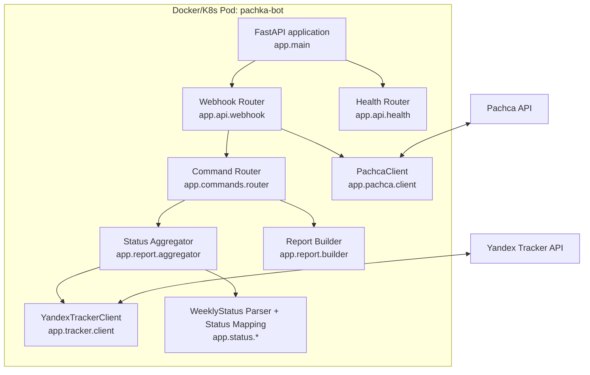
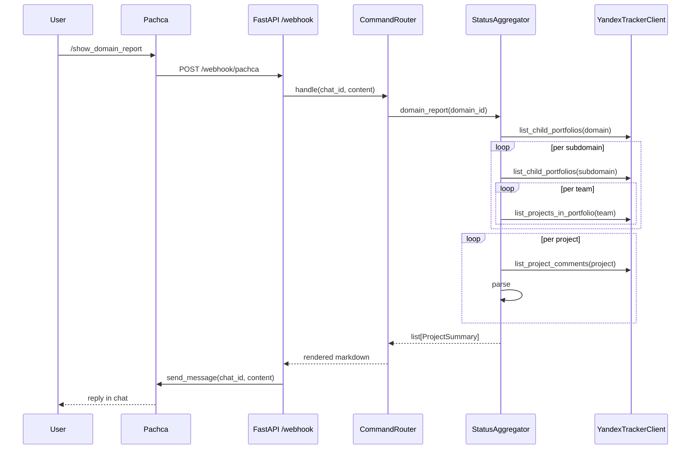
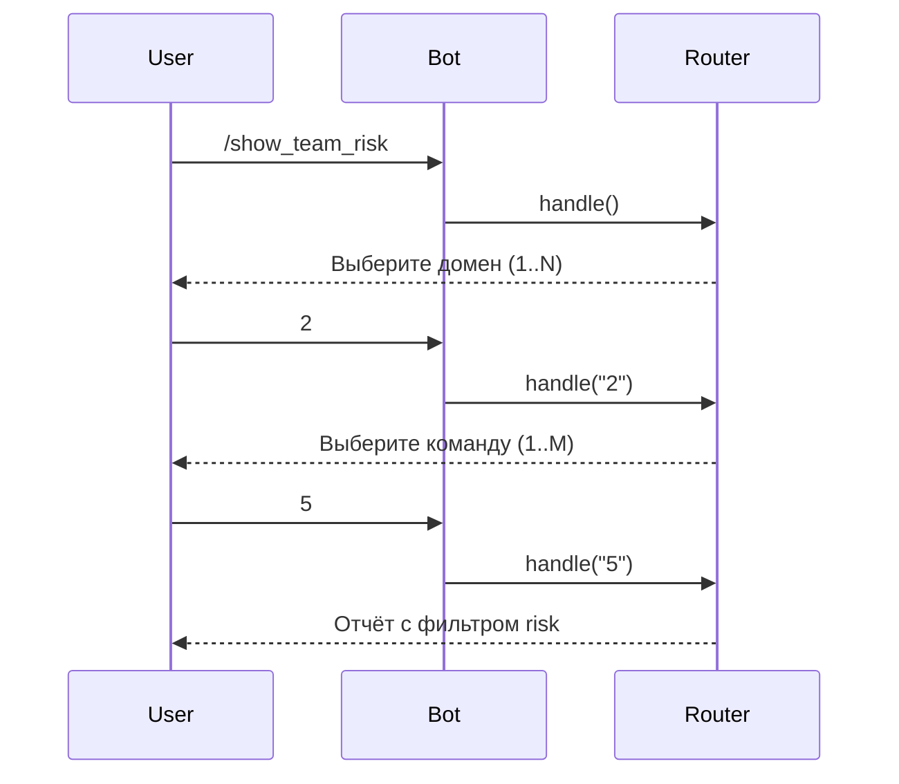
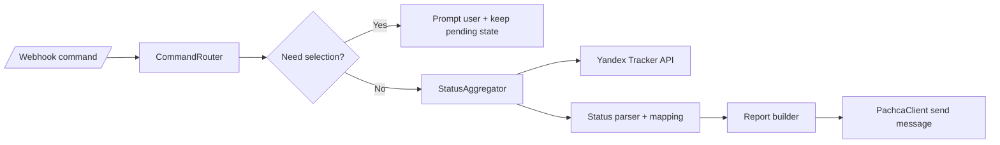
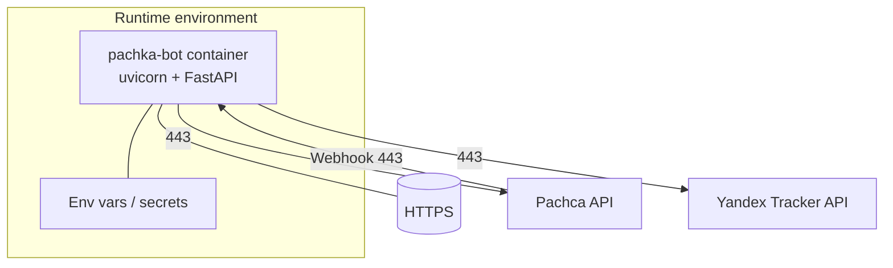

# Архитектурное ревью: текущая реализация `pachka-bot`

> Версия системы: `0.1.0` (по `FastAPI` app metadata и `/health`).

## 1. Цель документа

Документ описывает **фактическую (as-is)** архитектуру текущей реализации сервиса `pachka-bot`:
- системный контекст и внешние интеграции;
- контейнеры и ключевые компоненты;
- основные use case и последовательности вызовов;
- API-контракты и эксплуатационные характеристики;
- ограничения, риски и ближайшие рекомендации.

---

## 2. Функциональный скоуп текущей версии

Сервис реализует Telegram-like bot workflow для мессенджера Пачка:

1. Принимает webhook-события от Пачки (`POST /webhook/pachca`).
2. Разбирает slash-команды (`/show_*`, `/help`).
3. Для отчётных команд обращается в Yandex Tracker:
   - получает иерархию портфелей (домен → поддомен → команда),
   - получает проекты,
   - читает комментарии проектов,
   - извлекает `#WeeklyStatus`.
4. Агрегирует/фильтрует проекты по бизнес-статусам.
5. Формирует Markdown-ответ и отправляет обратно в чат Пачки.

Поддерживаемые типы отчётов:
- полный отчёт,
- риски,
- заблокированные,
- по плану,
- кросс-командные (`tag == cross`),
на уровнях: домен / поддомен / команда.

---

## 3. C4 — System Context (L1)

```mermaid
flowchart LR
    U[Пользователь в Пачке\n(менеджер/PMO)] -->|slash-команда| P[Pachca Platform]
    P -->|Webhook HTTP POST| B[pachka-bot]
    B -->|REST API| T[Yandex Tracker API]
    B -->|REST API send message| P
```

### Описание
- `pachka-bot` — центральная система, которая оркестрирует запросы и сбор данных.
- Пачка выступает одновременно источником входящих команд и каналом доставки ответа.
- Tracker — источник доменной структуры, проектов и комментариев.

---

## 4. C4 — Container (L2)



### Контейнеры/модули
- Один runtime-контейнер Python 3.11+.
- Внутренние границы — модульные (слои API / orchestration / integration / parsing / rendering).
- Хранилища состояния не используются: pending-диалоги хранятся in-memory в `CommandRouter`.

---

## 5. C4 — Component (L3): ключевые компоненты и ответственность

### 5.1 Web/API слой
- `app.main`:
  - собирает зависимости в `lifespan`;
  - регистрирует роутеры;
  - конфигурирует structlog.
- `app.api.webhook`:
  - принимает payload команды;
  - проверяет подпись `X-Pachca-Signature` (без блокировки запроса при mismatch);
  - вызывает маршрутизацию команды;
  - отправляет reply в Пачку;
  - при ошибках возвращает fallback-текст пользователю.
- `app.api.health`:
  - проверяет доступность Tracker/Pachca через `ping()`;
  - возвращает `healthy` только если обе зависимости доступны.

### 5.2 Оркестрация команд
- `CommandRouter`:
  - разбирает slash-команду;
  - управляет multi-step диалогом выбора домена/поддомена/команды;
  - хранит pending-состояние по `chat_id`;
  - вызывает соответствующий отчёт в агрегаторе и рендерер.

### 5.3 Доменная агрегация
- `StatusAggregator`:
  - строит отчёты по уровням дерева;
  - на уровнях `subdomain`/`domain` дедуплицирует проекты по `project.id`;
  - извлекает последний `#WeeklyStatus` из комментариев;
  - применяет freshness-политику (`status_freshness_days`, default 6);
  - маппит технический статус Tracker (`entityStatus`) в бизнес-статус.

### 5.4 Интеграции
- `YandexTrackerClient`:
  - REST-вызовы к `/v2/entities/portfolio/*`, `/v2/entities/project/*`, `/comments`;
  - постраничная выборка `_search`;
  - парсинг DTO → dataclass модели.
- `PachcaClient`:
  - отправка сообщений через `/messages`;
  - авто-сплит длинных сообщений (`<= 4000` символов на chunk).

### 5.5 Формирование ответа
- `report.builder`:
  - текстовые блоки markdown;
  - фильтры (`risk`, `blocked`, `on_track`, `cross`);
  - справка `/help`.
- `status.parser`:
  - парсинг шаблона комментария с `#WeeklyStatus`;
  - извлечение `Comments`, `DL по решению`, признак свежести.

---

## 6. Основные Use Case (as-is)

### UC-001: Формирование отчёта по команде/поддомену/домену
1. Пользователь отправляет `/show_*` в Пачке.
2. Пачка вызывает `POST /webhook/pachca`.
3. Сервис (при необходимости) запрашивает выбор уровня (номер).
4. После выбора:
   - читает структуры портфелей,
   - собирает проекты,
   - читает комментарии по каждому проекту,
   - определяет бизнес-статус,
   - рендерит markdown.
5. Публикует сообщение в чат Пачки.

### UC-002: Вывод справки и справочников
- `/help` — список команд.
- `/show_domain_list` / `/show_subdomain_list` / `/show_team_list` — листинги портфелей с ссылками в Tracker.

### UC-003: Health-check
- Внешняя система мониторинга вызывает `GET /health`.
- Сервис проверяет `tracker.ping()` и `pachca.ping()`.
- Возвращает `healthy` или `degraded`.

---

## 7. Диаграммы последовательности

### 7.1 Отчёт по домену (пример `/show_domain_report`)



### 7.2 Multi-step выбор (пример `/show_team_risk`)



---

## 8. API спецификация текущей реализации

### 8.1 `POST /webhook/pachca`
**Назначение:** входная точка команд Пачки.

**Payload (минимум):**
```json
{
  "content": "/show_domain_report",
  "chat_id": 123456
}
```

Поля `user_id`, `id` допустимы, но необязательны.

**Headers:**
- `X-Pachca-Signature` — используется для HMAC-проверки.

**Response:**
```json
{ "status": "ok" }
```

### 8.2 `GET /health`
**Назначение:** проверка доступности приложения и внешних API.

**Response (пример):**
```json
{
  "status": "healthy",
  "version": "0.1.0",
  "tracker": "ok",
  "pachca": "ok"
}
```

---

## 9. Данные и правила обработки

### 9.1 Иерархия портфелей
- Конфиг задаёт один или несколько `portfolio_domain_ids`.
- Дальше traversal:
  - `domain -> subdomains`;
  - `subdomain -> teams`;
  - `team -> projects`.

### 9.2 Логика бизнес-статуса
1. Берётся `project.entityStatus`.
2. Маппинг:
   - `according_to_plan` -> `ON_TRACK`
   - `at_risk` -> `AT_RISK`
   - `blocked` -> `BLOCKED`
   - иное -> `UNKNOWN`
3. Проверяется последний комментарий с `#WeeklyStatus`.
4. Если комментарий отсутствует или старше порога свежести — итоговый статус принудительно `UNKNOWN`.

### 9.3 Фильтры отчётов
- `risk`: только `AT_RISK`.
- `blocked`: только `BLOCKED`.
- `on_track`: только `ON_TRACK`.
- `cross`: проект содержит тег `cross`.

---

## 10. Нефункциональные аспекты

### 10.1 Надёжность и отказоустойчивость
- Ошибки обработки команды перехватываются на webhook-слое, пользователю отправляется fallback-сообщение.
- Ошибки отправки в Пачку логируются.
- Персистентного queue/retry нет (at-most-once в рамках webhook-вызова).

### 10.2 Безопасность
- Конфиденциальные токены читаются из окружения.
- Реализована HMAC-проверка подписи webhook, но при неуспехе запрос **не блокируется** (логируется warning).
  - Это важно зафиксировать как текущий риск.

### 10.3 Производительность
- Основная задержка: множественные последовательные вызовы Tracker, особенно `comments` на каждый проект.
- Потенциальное узкое место при росте количества проектов/команд.
- Нет кэша/батчинга/параллельной fan-out обработки в агрегаторе (as-is).

### 10.4 Наблюдаемость
- Structlog + request correlation (`req_id`) на webhook-потоке.
- Health endpoint c деталями по зависимостям.
- Нет отдельной метрики latency/error-rate/prometheus экспорта.

---

## 11. Ограничения текущей реализации

1. Нет scheduled-job для регулярной рассылки (только on-demand команды через webhook).
2. Нет интеграции с Confluence/Redis (против более широкого исходного видения PMO-документа).
3. In-memory состояние диалога (`_pending`) теряется при рестарте.
4. Проверка подписи webhook не enforcement-блокирующая.
5. Возможна высокая латентность на больших портфелях из-за последовательного I/O к Tracker.

---

## 12. Рекомендации следующего этапа

1. **Security hardening:** отклонять webhook с неверной подписью (HTTP 401/403).
2. **Scalability:** распараллелить получение проектов/комментариев с ограничением concurrency.
3. **State durability:** вынести pending-сессии в Redis при необходимости устойчивых диалогов.
4. **Observability:** добавить метрики (p95 latency, error counters, calls to Tracker/Pachca).
5. **Product completeness:** добавить планировщик регулярных отчётов и (при необходимости) публикацию в Confluence.

---

## 13. C4 — Dynamic view (сводно)



---

## 14. Deployment view (L4, упрощённо)



Текущая схема развёртывания минимальна: один экземпляр сервиса без выделенной БД/кэша.
